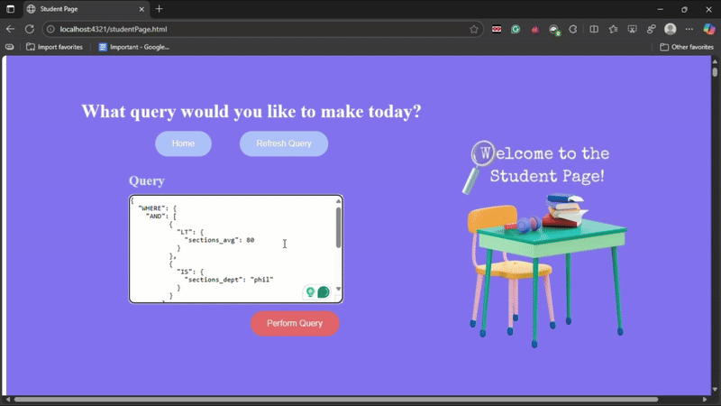

# InsightUBC - A UBC Course Explorer

A full-stack **TypeScript web app** that lets users query, filter, and explore all UBC course and classroom data through a custom JSON-based query engine.

The project includes:
- A **backend query engine** (Node.js + TypeScript) that processes complex queries on large datasets.
- A **frontend interface** for visual exploration of UBC courses and rooms.

---

## 🎬 Demo Preview




##  Live Demo


**Example query:**
```json
{
  "WHERE": {
        "AND": [
          {
            "LT": {
              "sections_avg": 80
            }
          },
          {
            "IS": {
              "sections_dept": "phil"
            }
          }
        ]
      },
  "OPTIONS": {
    "COLUMNS": [
      "sections_dept",
      "sections_id",
      "sections_avg"
    ],
    "ORDER": "sections_avg"
  }
}

```
## 🎥 Full Demo Video

▶️ [Watch the 2-minute demo](https://drive.google.com/file/d/1yJBpFkY0_vYoaI6qGXkgVxOIYJxVRLXP/view?usp=sharing)

---

## Features

-  Search all UBC courses by department, instructor, average, and year  
-  Query classrooms by building and seating capacity  
-  Built-in query validator (InsightUBC-style JSON)  
-  Persistent data storage (`/data` folder)  
-  REST API endpoints for dataset upload, listing, and querying  
-  Frontend interface for interactive search and visualization  

---

## Tech Stack

| Layer | Tools |
|-------|-------|
| **Frontend** | HTML / CSS / TypeScript / React *(if applicable)* |
| **Backend** | Node.js, Express, TypeScript |
| **Storage** | JSON persistence in `/data` |
| **Deployment** | Docker + Render *(or Railway/Fly.io)* |

---

## ⚙️ Setup Instructions

### 1️⃣ Clone the repository
```bash
git clone https://github.com/nilay1710/InsightUBC.git
cd InsightUBC
```

### 2️⃣ Install dependencies
```bash
npm install
```

### 3️⃣ Start the backend
```bash
npm run dev
```
Server runs at [http://localhost:4321](http://localhost:4321)

### 4️⃣ Load datasets
In another terminal:
```bash
curl.exe -X PUT --data-binary "@test/resources/archives/bigDataset.zip" ^
  -H "Content-Type: application/x-zip-compressed" ^
  http://localhost:4321/dataset/sections/sections

curl.exe -X PUT --data-binary "@test/resources/archives/campus.zip" ^
  -H "Content-Type: application/x-zip-compressed" ^
  http://localhost:4321/dataset/rooms/rooms
```

### 5️⃣ Run a query
Create a file called `query.json`:
```json
{
  "WHERE": { "IS": { "sections_dept": "cpsc*" } },
  "OPTIONS": {
    "COLUMNS": ["sections_dept", "sections_avg"],
    "ORDER": "sections_avg"
  }
}
```
Then run:
```bash
curl.exe -X POST -H "Content-Type: application/json" ^
  --data-binary "@query.json" ^
  http://localhost:4321/query
```

---

## API Endpoints

| Method | Route | Description |
|--------|-------|--------------|
| `PUT` | `/dataset/:id/:kind` | Add a dataset (`sections` or `rooms`) |
| `GET` | `/datasets` | List all loaded datasets |
| `POST` | `/query` | Execute a JSON query |

---

## Project Structure
```
project/
│
├── src/                 # TypeScript source files
│   ├── controller/      # InsightFacade logic
│   ├── rest/            # Express endpoints
│   └── util/            # Helpers and validators
│
├── data/                # Persisted dataset files
├── test/resources/      # Dataset archives
└── frontend/            # Frontend client
```

---


